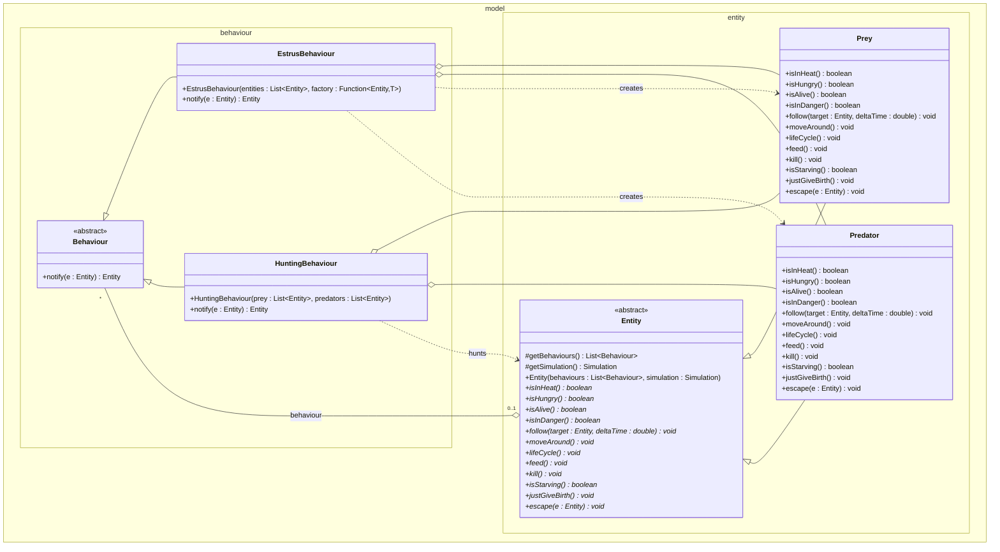

```mermaid
classDiagram
    direction TB
    namespace model {
    namespace behaviour {
        class Behaviour {
            <<abstract>>
            +notify(e : Entity) Entity
        }

        class EstrusBehaviour {
            +EstrusBehaviour(entities : List~Entity~, factory : Function~Entity,T~)
            +notify(e : Entity) Entity
        }

        class HuntingBehaviour {
            +HuntingBehaviour(prey : List~Entity~, predators : List~Entity~)
            +notify(e : Entity) Entity
        }
    }

    namespace entity {
        class Entity {
            <<abstract>>
            #getBehaviours() List~Behaviour~
            #getSimulation() Simulation
            +Entity(behaviours : List~Behaviour~, simulation : Simulation)
            +isInHeat() boolean*
            +isHungry() boolean*
            +isAlive() boolean*
            +isInDanger() boolean*
            +follow(target : Entity, deltaTime : double) void*
            +moveAround() void*
            +lifeCycle() void*
            +feed() void*
            +kill() void*
            +isStarving() boolean*
            +justGiveBirth() void*
            +escape(e : Entity) void*
        }

        class Prey {
            +isInHeat() boolean
            +isHungry() boolean
            +isAlive() boolean
            +isInDanger() boolean
            +follow(target : Entity, deltaTime : double) void
            +moveAround() void
            +lifeCycle() void
            +feed() void
            +kill() void
            +isStarving() boolean
            +justGiveBirth() void
            +escape(e : Entity) void
        }

        class Predator {
            +isInHeat() boolean
            +isHungry() boolean
            +isAlive() boolean
            +isInDanger() boolean
            +follow(target : Entity, deltaTime : double) void
            +moveAround() void
            +lifeCycle() void
            +feed() void
            +kill() void
            +isStarving() boolean
            +justGiveBirth() void
            +escape(e : Entity) void
        }
    }
    }

    %% Héritage
    Behaviour <|-- EstrusBehaviour
    Behaviour <|-- HuntingBehaviour

    Entity <|-- Prey
    Entity <|-- Predator

    %% Associations
    Entity "0..1" o-- "*" Behaviour : behaviour
    EstrusBehaviour o-- Prey
    EstrusBehaviour o-- Predator
    HuntingBehaviour o-- Prey
    HuntingBehaviour o-- Predator

    %% Dépendances
    EstrusBehaviour ..> Prey : creates
    EstrusBehaviour ..> Predator : creates
    HuntingBehaviour ..> Entity : hunts
```
