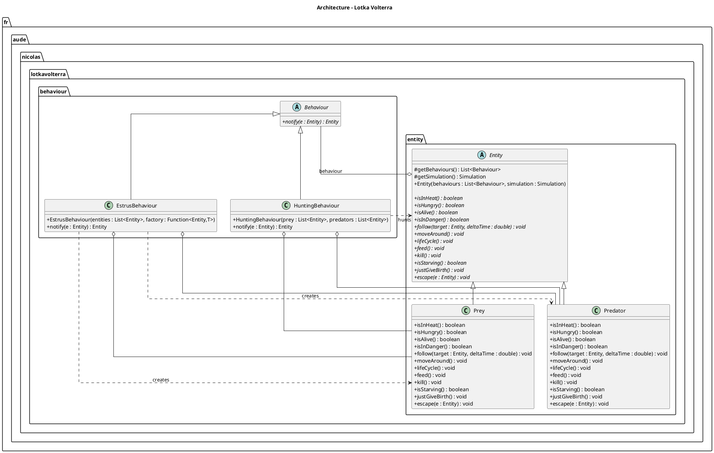

```plantuml
@startuml
title Architecture - Lotka Volterra

skinparam classAttributeIconSize 0
skinparam linetype ortho
package "fr.aude.nicolas.lotkavolterra" {
package "behaviour" {

    abstract class Behaviour {
        {abstract} +notify(e : Entity) : Entity
    }

    class EstrusBehaviour {
        +EstrusBehaviour(entities : List<Entity>, factory : Function<Entity,T>)
        +notify(e : Entity) : Entity
    }

    class HuntingBehaviour {
        +HuntingBehaviour(prey : List<Entity>, predators : List<Entity>)
        +notify(e : Entity) : Entity
    }

    Behaviour <|-- EstrusBehaviour
    Behaviour <|-- HuntingBehaviour
}

package "entity" {

    abstract class Entity {
        #getBehaviours() : List<Behaviour>
        #getSimulation() : Simulation
        +Entity(behaviours : List<Behaviour>, simulation : Simulation)

        {abstract} +isInHeat() : boolean
        {abstract} +isHungry() : boolean
        {abstract} +isAlive() : boolean
        {abstract} +isInDanger() : boolean
        {abstract} +follow(target : Entity, deltaTime : double) : void
        {abstract} +moveAround() : void
        {abstract} +lifeCycle() : void
        {abstract} +feed() : void
        {abstract} +kill() : void
        {abstract} +isStarving() : boolean
        {abstract} +justGiveBirth() : void
        {abstract} +escape(e : Entity) : void
    }

    class Prey {
        +isInHeat() : boolean
        +isHungry() : boolean
        +isAlive() : boolean
        +isInDanger() : boolean
        +follow(target : Entity, deltaTime : double) : void
        +moveAround() : void
        +lifeCycle() : void
        +feed() : void
        +kill() : void
        +isStarving() : boolean
        +justGiveBirth() : void
        +escape(e : Entity) : void
    }

    class Predator {
        +isInHeat() : boolean
        +isHungry() : boolean
        +isAlive() : boolean
        +isInDanger() : boolean
        +follow(target : Entity, deltaTime : double) : void
        +moveAround() : void
        +lifeCycle() : void
        +feed() : void
        +kill() : void
        +isStarving() : boolean
        +justGiveBirth() : void
        +escape(e : Entity) : void
    }

    Entity <|-- Prey
    Entity <|-- Predator
}

' Associations
Entity  o--  Behaviour : behaviour
EstrusBehaviour  o--  Prey
EstrusBehaviour  o--  Predator

HuntingBehaviour  o--  Prey
HuntingBehaviour  o--  Predator

EstrusBehaviour ..> Prey : creates
EstrusBehaviour ..> Predator : creates
HuntingBehaviour ..> Entity : hunts

}
@enduml
```
